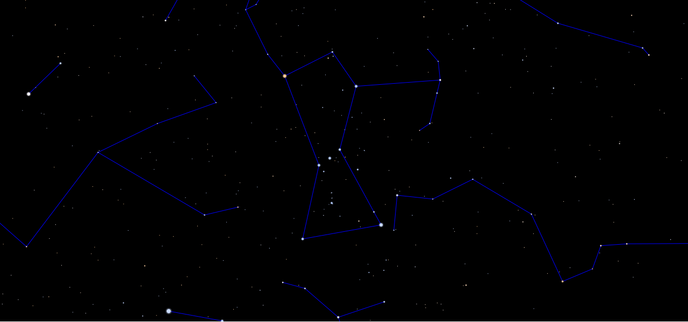

# 🌌 Rigel: Night Sky Simulator

Rigel is a modular **Java application** that simulates the night sky at any chosen time and location. It features a **graphical user interface** allowing users to adjust time and place, explore the sky, and visualize constellations. Built as part of the **CS-108: Practice of Object-Oriented Programming** course at EPFL, the project applied advanced Java concepts including **collections, generics, and design patterns**. Developed collaboratively with **Paola Matta**, the project emphasized teamwork, modularity, and robust software engineering practices.

## ✨ Project Highlights
- Interactive UI for adjusting time and location  
- Realistic night sky simulation with constellation overlays  
- Implemented multiple OOP design patterns  
- Applied collections, generics, and immutability principles  
- Included unit testing and Git version control  

---

📜 Developed at EPFL — Object-Oriented Software Design (Spring 2020)
